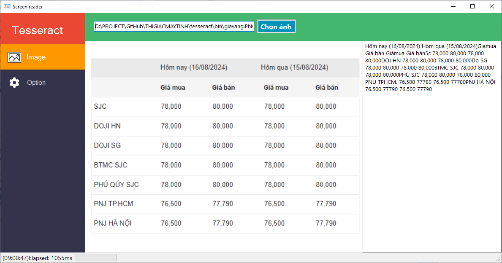

# Tesseract - nhận diện ký tự OCR

Tesseract là thư viện nhận diện ký tự quang học có khả năng nhận diện ký tự trên màn hình rất tốt (còn ký tự trên ảnh chụp thì hơi yếu).

## Ứng dụng
- Đọc ký tự trên file ảnh, file không cho phép copy
- Đọc ký tự trên web, dữ liệu cập nhật liên tục hoặc không cho phép copy

Tùy vào mỗi bài toán khác nhau mà các bạn cần điều chỉnh cho phù hợp. Ảnh trên là kết quả raw được trả về từ Tesseract.

## Hướng dẫn build

- Bước 1: cài đặt Visual Studio 2017 trở lên
- Bước 2: build **TextReader_Cpp.sln** để đọc tất cả ảnh trong folder bin
- Bước 3: build **ScreenReader_UI.sln** để xem cách gọi hàm từ C# qua C++ và hiển thị

# Bài viết hướng dẫn chi tiết

https://thigiacmaytinh.com/nhan-dien-van-ban-bang-tesseract/

